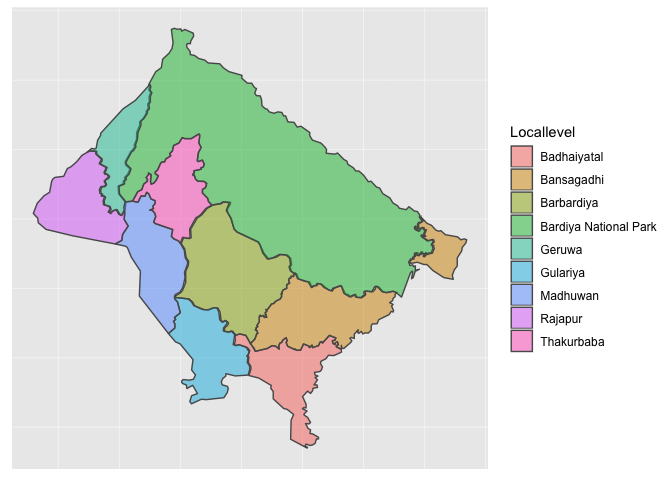
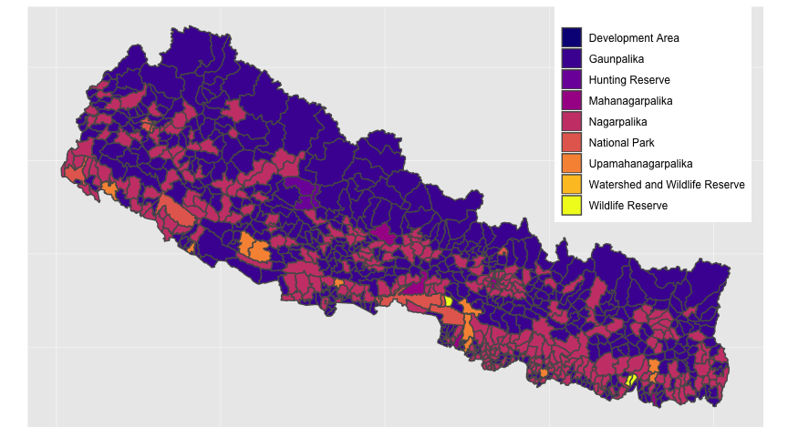

# Nepal Municipalities Map

The new clean geojson data is created by combining geojson-data from
[mofald](http://103.69.124.141/) and
[localboundries.oknp.org](http://localboundries.oknp.org/) as there were
certain municipalites missing in one source while present in another.
Each geojson feature contains the following properties. `wards` is count
of wards in that particular municipality.

``` json
{
  "type": "Feature",
  "properties": {
    "locallevel_fullcode": 55801,
    "province": 5,
    "district_code": 58,
    "district": "Bardiya",
    "locallevel_code": 1,
    "locallevel_name": "Badhaiyatal",
    "locallevel_name_nepali": "बढैयाताल गाउँपालिका",
    "locallevel_type": "Gaunpalika",
    "wards": 9.0
  }
}
```

There are 2 geojson files - high resolution
[municipalites.high.geojson](%22out/municipalities.high.geojson%22)
\[44.71 MB\] and simplified
[municipalities.simplified.geojson](%22out/municipalities.simplified.geojson%22)
\[3.46 MB\]. Use the one appropriate for you.

You may use the [municapalities.csv](out/municapalities.csv) for names
and codes only if you don’t need coordinates data.

## Inside Geojson

There are 775 entries (instead of 753) in
[geojson](out/out/municipalities.simplified.geojson) and
[csv](out/municapalities.csv) file. That’s because there are other areas
besides municipalities.

| Type                           | Count |
| :----------------------------- | ----: |
| Development Area               |     1 |
| Gaunpalika                     |   461 |
| Hunting Reserve                |     3 |
| Mahanagarpalika                |     6 |
| Nagarpalika                    |   276 |
| National Park                  |    11 |
| Upamahanagarpalika             |    11 |
| Watershed and Wildlife Reserve |     1 |
| Wildlife Reserve               |     5 |
| Total                          |   775 |

However if you count the number of palikas (municipalites) in geojson,
you will see that there’s 754 instead of 753.

| Locallevel Type    | Count |
| :----------------- | ----: |
| Gaunpalika         |   461 |
| Mahanagarpalika    |     6 |
| Nagarpalika        |   276 |
| Upamahanagarpalika |    11 |
| Total              |   754 |

Don’t worry. The extra municipality is due to “Bansagadhi” - a
municipality of Badriya which has 2 polygon regions as shown below.

<!-- -->

Here’s the complete map of Nepal showing municipalities and all other
regions.

<!-- -->
